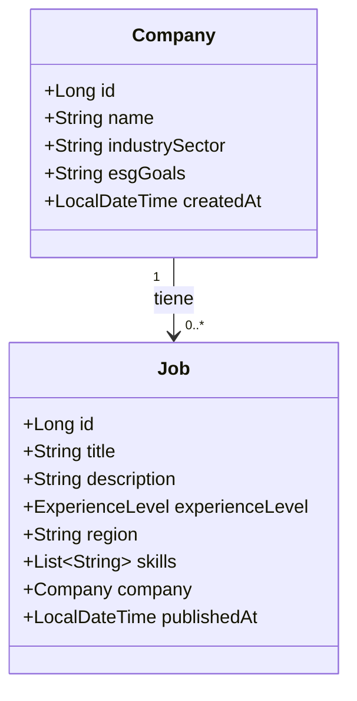

# Guía de Investigación: Entidades JPA con Spring Boot 🍃

Esta guía te ayudará a comprender los conceptos necesarios para implementar las entidades **Company** y **Job** en tu proyecto Spring Boot. Dado que el proyecto ya tiene configurados Maven, MySQL, JPA y Lombok, nos enfocaremos en las anotaciones y el diseño correcto de estas clases.

---

## 🗺️ Mapa Relacional de las Entidades
Para comprender cómo se relacionan las tablas en la base de datos a través de JPA, analiza el siguiente diagrama:



---

## 1. Convenciones y Estructura en Java 📂
En Java y Spring Boot, los nombres de las clases (y por ende de los archivos `.java`) deben seguir la convención **PascalCase** (empezar con mayúscula). 
* **Incorrecto:** `entity/company.java`
* **Correcto:** [Company.java](file:///home/fernando/Escritorio/Simulacion-project-Equipo-79-APP-BIT/backend/src/main/java/com/appbit/backend/entity/Company.java) y [Job.java](file:///home/fernando/Escritorio/Simulacion-project-Equipo-79-APP-BIT/backend/src/main/java/com/appbit/backend/entity/Job.java).

Debes crear un paquete (carpeta) llamado `entity` dentro de tu paquete principal:
📂 `src/main/java/com/appbit/backend/entity/`

---

## 2. Conceptos Clave de JPA a Investigar 🔍

JPA (Java Persistence API / Jakarta Persistence) utiliza **anotaciones** para mapear clases de Java a tablas de bases de datos relacionales. Investiga las siguientes anotaciones indispensables para esta tarea:

### A. Anotaciones de Entidad Básica
*   `@Entity`: Le dice a JPA que esta clase es una entidad persistente y debe mapearse a una tabla.
*   `@Table(name = "nombre_tabla")`: Permite especificar el nombre exacto de la tabla en la base de datos (por ejemplo, `companies` o `jobs`). Si no se usa, la tabla tomará el nombre de la clase por defecto.
*   `@Id`: Define cuál atributo es la clave primaria (Primary Key).
*   `@GeneratedValue(strategy = GenerationType.IDENTITY)`: Indica que la clave primaria se auto-incrementará en la base de datos (comportamiento estándar en MySQL).

### B. Mapeo de Enums (Niveles de Experiencia)
Para el atributo `experienceLevel` (JUNIOR, MID, SENIOR), debes crear un tipo `enum` en Java. Investiga:
*   `@Enumerated(EnumType.STRING)`: 
    > [!IMPORTANT]
    > Por defecto, JPA guarda los enums en la base de datos como números (0 para JUNIOR, 1 para MID, etc.). Si el día de mañana agregas un nivel intermedio, el orden cambia y los datos se corrompen. **`EnumType.STRING` guarda el texto exacto ("JUNIOR") en la base de datos**, lo cual es mucho más seguro y legible.

### C. Colecciones Elementales (`skills`)
El requerimiento te pide usar `@ElementCollection` para las habilidades (`skills`), que es una lista de Strings (`List<String>`).
*   `@ElementCollection`: Se usa para mapear colecciones de tipos básicos (como `String`, `Integer`, etc.) o clases `@Embeddable` que no tienen un ciclo de vida de entidad propio. JPA creará automáticamente una tabla secundaria para almacenar estos elementos.
*   `@CollectionTable(name = "job_skills", joinColumns = @JoinColumn(name = "job_id"))`: Te permite personalizar el nombre de la tabla secundaria donde se guardarán las habilidades y el nombre de la columna que hace referencia al `Job` (Foreign Key).

### D. Relaciones entre Entidades (Foreign Keys)
La relación entre `Company` y `Job` es que **muchos trabajos (Jobs) pertenecen a una empresa (Company)**. En la entidad `Job`, en lugar de guardar un simple `Long companyId`, JPA te exige modelarlo como un objeto completo:
```java
private Company company;
```
Para mapearlo correctamente, debes investigar:
*   `@ManyToOne`: Indica la relación de "Muchos a Uno".
*   `@JoinColumn(name = "company_id")`: Especifica el nombre de la columna que actuará como Foreign Key en la tabla de trabajos.

### E. Fechas Automáticas (`createdAt` y `publishedAt`)
Para `createdAt`, lo ideal es que se registre automáticamente al insertar el registro. Investiga:
*   `@CreationTimestamp` (de Hibernate): Llena el campo automáticamente con la fecha y hora del sistema al hacer el primer insert.
*   Alternativamente, puedes inicializar el campo en Java usando `LocalDateTime.now()` en el constructor de la clase.

---

## 3. Uso de Lombok 🥩
En el archivo `pom.xml` tienes declarada la dependencia de Lombok. Esto te permite evitar escribir código repetitivo (boilerplates).

Investiga las siguientes anotaciones de Lombok para colocar sobre tus entidades:
*   `@Getter` y `@Setter`: Generan automáticamente los métodos get y set.
*   `@NoArgsConstructor`: Genera el constructor vacío (requerido obligatoriamente por JPA para instanciar la entidad al leerla de la base de datos).
*   `@AllArgsConstructor`: Genera un constructor con todos los atributos (muy útil para pruebas).
*   `@Builder`: Permite usar el patrón de diseño Builder para instanciar objetos de manera limpia.

> [!WARNING]
> **Evita usar `@Data` o `@ToString` en entidades JPA con relaciones.**
> `@Data` genera automáticamente un método `toString()` que incluye todos los campos. Si `Job` tiene una referencia a `Company` y `Company` tiene una lista de `Job` (relación bidireccional), llamar al `toString()` causará una **recursión infinita** y la aplicación lanzará un error de tipo `StackOverflowError`. Es preferible usar `@Getter`, `@Setter` y definir constructores específicos.

---

## 4. Configuración del Ciclo de Vida de la Base de Datos (DDL) ⚙️
Para que Hibernate cree automáticamente las tablas en tu base de datos MySQL al arrancar la aplicación, debes investigar esta propiedad en tu archivo `application.properties`:

*   `spring.jpa.hibernate.ddl-auto`
    *   `update`: Crea las tablas que no existen y actualiza la estructura si agregas nuevos campos, sin borrar los datos existentes. (Ideal para desarrollo).
    *   `create-drop`: Crea las tablas al iniciar y las borra al apagar la aplicación.
    *   `none`: No realiza ninguna acción.

---

## 🏁 Ruta de Trabajo Recomendada

1.  **Crear el Enum:** Crea un archivo llamado `ExperienceLevel.java` en una carpeta/paquete adecuado (por ejemplo, `com.appbit.backend.entity` o `com.appbit.backend.enums`).
2.  **Crear la Entidad Company:** Crea [Company.java](file:///home/fernando/Escritorio/Simulacion-project-Equipo-79-APP-BIT/backend/src/main/java/com/appbit/backend/entity/Company.java) con sus anotaciones.
3.  **Crear la Entidad Job:** Crea [Job.java](file:///home/fernando/Escritorio/Simulacion-project-Equipo-79-APP-BIT/backend/src/main/java/com/appbit/backend/entity/Job.java) mapeando la relación con `Company` y la lista `@ElementCollection` para las `skills`.
4.  **Agregar propiedades opcionales en application.properties:**
    ```properties
    spring.jpa.hibernate.ddl-auto=update
    spring.jpa.show-sql=true
    ```
5.  **Correr el backend:** Usa `./mvnw spring-boot:run` desde la terminal en el directorio `backend` y verifica en tu gestor de base de datos MySQL (por ejemplo, DBeaver o phpMyAdmin) que las tablas `companies`, `jobs` y `job_skills` se hayan creado automáticamente.
